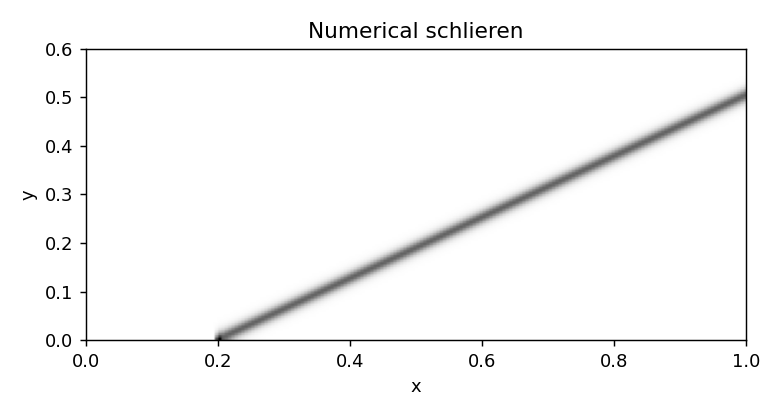
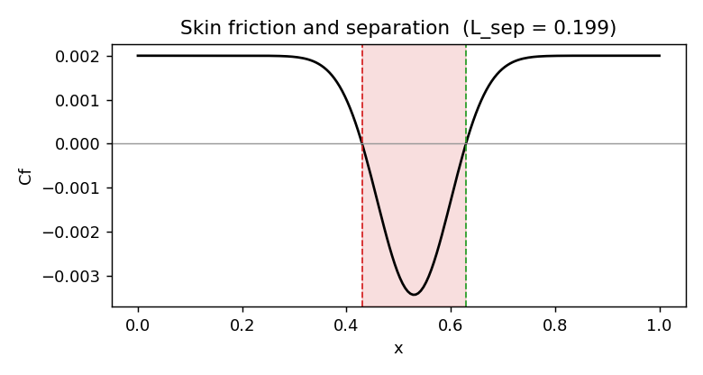
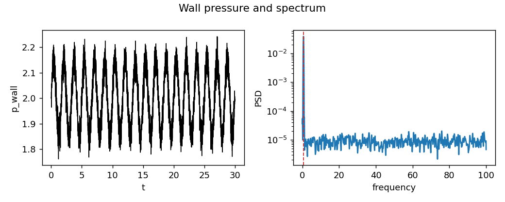
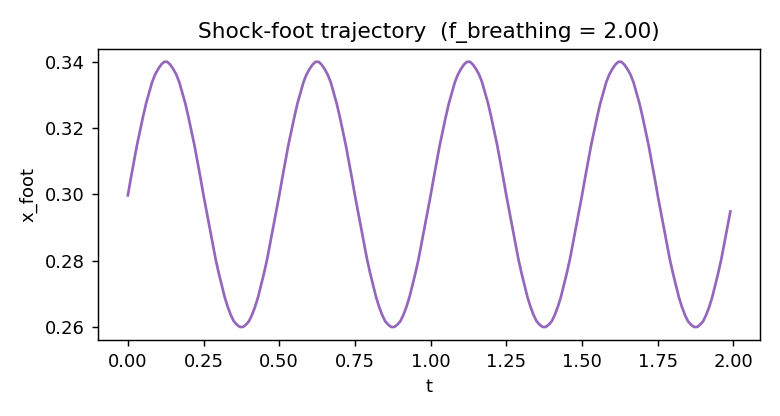

# ShockLens

**Turn shock-dominated CFD into interpretable SBLI events, then predict them from sparse sensors.**

ShockLens reads a compressible flow field (OpenFOAM `foamToVTK` output, or any
VTK), automatically extracts the shock-boundary-layer-interaction quantities that
actually matter, shock location and angle, separation and reattachment points,
separation length, wall-pressure loading, unsteady shock-breathing frequency, and
trains a small model to predict those quantities from a handful of wall-pressure
sensors. It runs end to end offline on synthetic, ground-truth-labelled data, so
you can install it and see the whole pipeline work before touching a solver.

The ML is deliberately small. v0.1 is a random-forest baseline over sparse
sensors. Temporal models and neural operators come later, once the extraction is
solid. The contribution is the extraction-and-benchmark layer, not the model.

## Where it fits in your workflow

ShockLens does not run CFD. It post-processes fields a simulation already
produced. The loop is: run the case once in OpenFOAM (or any solver, or an
experiment) and export VTK, then ShockLens reads that VTK, extracts the SBLI
events, and trains on them. Because it reads generic VTK, it is not tied to
OpenFOAM. The bundled synthetic data lets you run the whole tool with no
simulation at all, which is how the demo, tests, and CI work.

```
solver run (once)  ->  VTK  ->  ShockLens: extract events  ->  ML on sparse sensors  ->  scorecard + figures
```

## Figures

`shocklens plot` renders these from the offline data; on real cases they come
from your fields.

| | |
|---|---|
|  |  |
| Numerical schlieren of the oblique shock | Cf with the separation bubble marked |
|  |  |
| Wall-pressure signal and its spectrum | Shock-foot trajectory over time |

## The machine learning

ShockLens has two models, both deliberately light (no GPU, no deep-learning
stack in v0.1):

1. Sparse-sensor prediction. A random forest maps a handful of wall-pressure
   sensor readings to an SBLI target (separation length, shock position). This is
   the "predict the interaction from limited measurement" task that matters when
   you cannot see the whole field, as in experiments.
2. Shock-motion forecasting. A gradient-boosting model predicts where the shock
   goes next from its recent trajectory. That is the early-warning signal for
   separation and unstart. Run `shocklens forecast`.

The physics-extraction modules are not a detour from the ML, they are its data
engine: you cannot learn shock or separation behaviour without first turning raw
fields into clean, labelled trajectories, which is exactly what `detect`,
`separation`, and `track` produce. As fidelity rises (LES/DNS, real cases), the
ML grows: temporal deep models (LSTM/TCN), field reconstruction from sensors via
operator learning, and a forecaster that can sit inside a control loop. The
extraction layer keeps producing the labels those models train on.

```bash
shocklens forecast        # predict future shock position from its history
```

## Motivation

Shock-boundary-layer interaction limits high-speed flight: a small shock
displacement can trigger separation, large wall-pressure fluctuations, buffet,
thermal and structural loading, and inlet unstart. This is the focus of the CASL
group at FSU, whose SBLI work centres on wedge/Mach studies, axisymmetric
interactions, and hypersonic boundary layers.

Recent machine-learning work on shock flows splits into two camps, and both point
at the same missing piece:

- Control and reconstruction. Deep RL can suppress shock-induced separation and
  oscillations, for example on a transonic RAE2822 airfoil (Mondal, Vinuesa &
  Jagtap, arXiv:2511.07564, 2025) and on a laminar compression-ramp SBLI run in
  OpenFOAM (Tao et al., AIAA Journal 63(10), 2025). These methods are powerful
  but depend on expensive solver-in-the-loop training or full-field information.
  Variational assimilation of transonic SWBLI from sparse pressure (J. Comput.
  Phys. 538, 2025) shows sparse sensing is a live, hard problem.
- High-fidelity analysis. LES of SBLI over a turbine airfoil (arXiv:2512.12082,
  2025) shows the important outputs are interpretable structures, separation-bubble
  events, streaks, vortices, wall loading, not a global field RMSE.

## The gap

> There is no simple, reusable OpenFOAM-first toolkit that turns SBLI simulations
> into physics-labelled event data and trains lightweight, physics-aware models to
> predict shock and separation behaviour from sparse measurements.

That gap is practical, current, and scales from 2D tutorials to 3D LES. ShockLens
fills it.

## What it extracts

| Quantity | Why it matters |
|---|---|
| Shock-foot location and angle | shock position, oscillation, theta-beta-M validation |
| Separation point `x_sep` | onset of shock-induced separation |
| Reattachment point `x_reatt` | bubble recovery |
| Separation length `L_sep` | clearest single SBLI severity metric |
| Wall pressure and RMS | structural loading, buffet, inlet stability |
| Skin friction `Cf` | separation/reattachment indicator |
| Shock-breathing frequency | low-frequency unsteadiness from a Welch PSD |
| Numerical schlieren | shock visualisation and an ML input field |

## Repository layout

```text
shocklens/
├── shocklens/
│   ├── synthetic.py    # ground-truth oblique-shock + ramp data (offline, testable)
│   ├── detect.py       # numerical schlieren, shock-line fit, angle + foot
│   ├── separation.py   # Cf zero-crossings, RMS, PSD, breathing frequency
│   ├── track.py        # shock-foot trajectory over time (batch / unsteady)
│   ├── models.py       # sparse-sensor random-forest baseline (save/load)
│   ├── forecast.py     # gradient-boosting shock-motion forecaster
│   ├── plots.py        # schlieren, Cf, wall-pressure, trajectory figures
│   ├── metrics.py      # SBLI scorecard
│   ├── io.py           # VTK reader (OpenFOAM or any solver) + regrid
│   └── cli.py          # demo | extract | train | track | forecast | plot | info
├── examples/           # forwardStep, wedge, compression-ramp workflows
├── docs/figures/       # rendered example figures
├── tests/              # physics checks against known answers
├── comprehensive_smoke_test.py
├── CITATION.cff
├── CHANGELOG.md
├── pyproject.toml
└── README.md
```

## Case suite

| Case | Source | Physics | Status |
|---|---|---|---|
| `wedge_oblique` | analytic + `rhoCentralFoam/wedge15Ma5` | clean oblique shock, known angle | v0.1 |
| `forwardStep_Ma3` | `rhoCentralFoam/forwardStep` | Mach 3, shock reflections | v0.1 |
| `compressionRamp_2D` | compression-ramp SBLI | separation, reattachment, loading | v0.2 |
| `compressionRamp_3D_LES` | 3D LES/DES | spanwise corrugation, bubble breathing | v0.3 |

## Install

```bash
git clone https://github.com/yourusername/shocklens.git
cd shocklens
pip install -e .              # core: numpy, scipy, scikit-learn
pip install -e ".[vtk]"       # adds pyvista for reading solver output
pip install -e ".[dev]"       # adds pytest
```

No PyTorch needed for v0.1.

## Quickstart, no solver required

```bash
shocklens demo            # extraction + prediction scorecard
shocklens track           # follow an oscillating shock, recover the breathing rate
shocklens plot            # write the figures above to ./figures
```

`shocklens demo` prints the offline scorecard:

```json
{
  "shock_angle_detected": 32.24,
  "shock_angle_true": 32.24,
  "shock_foot_detected": 0.2,
  "separation": {"x_sep": 0.43, "x_reatt": 0.629, "L_sep": 0.199, "separated": true},
  "L_sep_prediction_r2": 0.96,
  "L_sep_prediction_mae": 0.0109
}
```

The detected shock angle matches the theta-beta-M value because the synthetic
field is built from it; that is the test, not a coincidence.

## Reproducibility

Everything offline is deterministic under fixed seeds, so `shocklens demo` and
the test suite produce the same numbers on any machine. The core depends only on
numpy, scipy, and scikit-learn, with no GPU and no compiled extensions, so it
installs the same way everywhere. To reproduce the full check:

```bash
pip install -e ".[dev]"
pytest -q                       # 15 physics + pipeline tests
python comprehensive_smoke_test.py   # includes the VTK round trip
```

Trained models persist with `model.save(path)` / `SparseSensorModel.load(path)`.

## On real solver output

```bash
# after running an OpenFOAM rhoCentralFoam case and foamToVTK:
shocklens extract path/to/case/VTK/case_100.vtk --nx 300 --ny 160
```

See each example's README for the full workflow.

## Why this over a generic neural-operator surrogate

A full-field FNO surrogate predicts everything and is judged by RMSE, which is a
poor signal near a shock and a crowded research space. ShockLens predicts the
specific SBLI events that drive loading and control, which is more interpretable,
cheaper to train, and a sharper contribution. It also gets more valuable as
fidelity rises: the richer the LES/DNS field, the more there is to extract.

## Roadmap

- v0.1 (this release): shock detection validated against theory, separation from
  Cf, wall-pressure PSD, sparse-sensor prediction of separation length.
- v0.2: 2D compression-ramp SBLI cases, low-frequency shock-motion analysis,
  temporal prediction (TCN/LSTM) of shock position.
- v0.3: 3D LES fields, spanwise shock corrugation, bubble breathing, RANS vs LES
  event comparison.

## License

MIT. See [LICENSE](LICENSE).
