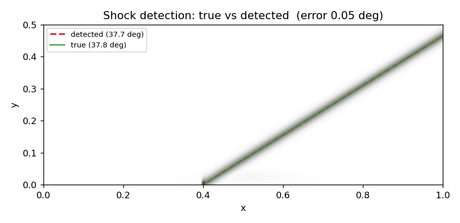
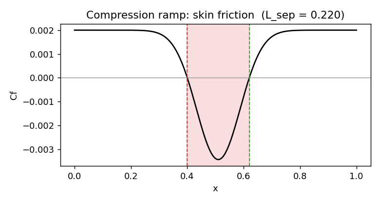

# ShockLens

Turn shock-dominated CFD into interpretable SBLI events, then predict them from a few wall sensors.

ShockLens reads a compressible flow field (OpenFOAM `foamToVTK` output, or any VTK) and pulls out the shock-boundary-layer-interaction quantities that drive loading and control: shock location and angle, separation and reattachment, separation length, wall-pressure loading, and the low-frequency shock-breathing rate. It then trains a small model to predict those quantities from a handful of wall-pressure sensors. The whole pipeline runs offline on synthetic, ground-truth data, so you can install it and watch it work before touching a solver.

## Where it fits

ShockLens does not run CFD. It post-processes a field your simulation already produced. Run the case once in OpenFOAM (or any solver, or an experiment), export VTK, and ShockLens reads that VTK, extracts the events, and trains on them. Because it reads generic VTK, it is not tied to OpenFOAM, and the bundled synthetic data drives the demo, the tests, and CI with no solver at all.

```
solver run (once)  ->  VTK  ->  extract events  ->  predict from sparse sensors  ->  scorecard + figures
```

## Figures

`shocklens overlay` and `shocklens plot` render these from the offline data; on real cases they come from your fields.

| | |
|---|---|
|  |  |
| Detected shock line (red) on the true line (green) and the schlieren ridge | Cf with the separation bubble marked |
|  |  |
| Wall-pressure signal and its spectrum | Shock-foot position over time |

## Quickstart, no solver needed

```bash
pip install -e ".[vtk]"
shocklens demo        # extraction + prediction scorecard
shocklens overlay     # field-level true-vs-detected shock figure
shocklens plot        # write the figures above to ./figures
```

`shocklens demo` prints:

```json
{
  "shock_angle_detected": 32.24,
  "shock_angle_true": 32.24,
  "shock_foot_detected": 0.2,
  "separation": {"x_sep": 0.43, "x_reatt": 0.629, "L_sep": 0.199, "separated": true},
  "L_sep_prediction_r2": 0.96,
  "L_sep_prediction_mae": 0.0109
}
```

The detected angle matches the theta-beta-M value because the synthetic field is built from it. That is the test, not a coincidence.

## What it extracts

| Quantity | Why it matters |
|---|---|
| Shock-foot location and angle | shock position, oscillation, theta-beta-M check |
| Separation point `x_sep` | onset of shock-induced separation |
| Reattachment point `x_reatt` | bubble recovery |
| Separation length `L_sep` | the single clearest severity metric |
| Wall pressure and RMS | structural loading, buffet, inlet stability |
| Skin friction `Cf` | separation/reattachment indicator |
| Shock-breathing frequency | low-frequency unsteadiness, from a Welch PSD |
| Numerical schlieren | shock visualisation and an ML input field |

## Physics first, ML second

The shock is found by physics, not by a network. Detection, separation, and the pressure spectrum are gradient, zero-crossing, and PSD operations checked against closed-form answers: the theta-beta-M angle, the known Cf crossings. They do not learn, so they do not drift, and they work the first time on a case they have never seen.

The ML only acts on what the physics produced. Sparse wall sensors map to separation length or shock position; the shock trajectory feeds a short forecast that flags separation or unstart before it arrives. On the bundled synthetic data the model scores near-perfect, but only because that data was built to be learnable, so those numbers check the plumbing rather than predictive power. The real numbers come from real fields. Physics is the cake here; the ML and the GPU paths are icing on top of it.

## Motivation

Shock-boundary-layer interaction limits high-speed flight. A small shock shift can trigger separation, large wall-pressure swings, buffet, and inlet unstart, and the low-frequency unsteadiness of the interaction has been open since Dolling's 2001 review. Recent ML work on these flows splits three ways: solving the PDE directly (PINNs and neural operators, which oscillate at discontinuities and still fight shocks), learning on extracted signals (sparse-pressure reconstruction, sensor-based reduced-order models), and control (deep RL that uses wall pressure and skin-friction separation as its state and reward). The control and ROM methods all need the same extracted events, yet there is no simple, reproducible, solver-agnostic tool that produces them. ShockLens is that tool. References are in [`REFERENCES.md`](REFERENCES.md).

## Reproducibility

Everything offline is deterministic under fixed seeds, so `shocklens demo` and the tests give the same numbers on any machine. The core needs only numpy, scipy, and scikit-learn, with no GPU and no compiled extensions. To run the full check:

```bash
pip install -e ".[dev,plot,vtk]"
make verify          # compile, lint, tests, end-to-end smoke test
```

## On real solver output

```bash
# after an OpenFOAM rhoCentralFoam run + foamToVTK:
shocklens extract path/to/VTK/case_1000.vtk --nx 300 --ny 160
```

Or describe the case in a small YAML file and run `shocklens run-case mycase.yaml`; the file is also your reproducibility record. See [`docs/PORTING.md`](docs/PORTING.md) and each example's README.

## License

MIT. See [LICENSE](LICENSE).
